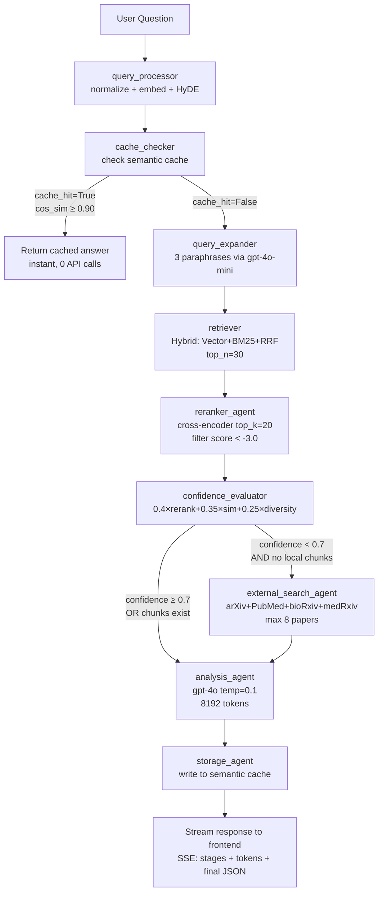

# Research Paper Assistant — Complete Demo Preparation Guide

> **For the professor demo on 2026-04-15**  
> This document covers: app flow, technical strategies, all numerical values, failure handling, main files, agent architecture, Claude Code multi-agent guide, and 20 judge Q&As.

---

## Table of Contents

1. [App Overview & Problem Statement](#1-app-overview--problem-statement)
2. [Tech Stack](#2-tech-stack)
3. [Full App Flow with Diagrams](#3-full-app-flow-with-diagrams)
4. [All Models & Numerical Configuration Values](#4-all-models--numerical-configuration-values)
5. [Core Strategies — What, Why, Benefits, Without It](#5-core-strategies--what-why-benefits-without-it)
6. [Data Storage Architecture](#6-data-storage-architecture)
7. [Failure Handling — Complete Table](#7-failure-handling--complete-table)
8. [Main Files Reference Guide](#8-main-files-reference-guide)
9. [LangGraph Agent Architecture Deep Dive](#9-langgraph-agent-architecture-deep-dive)
10. [Claude Code — Multi-Agent, Skills, Hooks Guide](#10-claude-code--multi-agent-skills-hooks-guide)
11. [20 Judge Q&As](#11-20-judge-qas)

---

## 1. App Overview & Problem Statement

### The Problem

Professors work with hundreds of research papers. When writing a literature review or answering a research question, they must:
- Manually search through their private paper library
- Cross-reference multiple papers for agreements and contradictions
- Identify research gaps
- Ensure every claim is backed by a specific citation

**This is slow, error-prone, and doesn't scale.**

### The Solution

A **local-first Research Paper Assistant** that:
1. Lets professors pre-load papers (PDFs, DOIs, URLs) into a private local database
2. Accepts natural language research questions
3. Automatically retrieves the most relevant passages from their library
4. If the library lacks coverage, fetches new papers from arXiv/PubMed/Semantic Scholar
5. Generates a grounded literature review: summary + agreements + contradictions + research gaps + citations
6. **Never fabricates** — every claim is backed by actual paper excerpts

### Key Design Principles
- **Library-first**: Always check local papers before hitting external APIs
- **Grounded output**: LLM instructed to only use provided excerpts (no hallucination)
- **Streaming**: Results stream token-by-token for real-time UX
- **Cost-aware**: Two-tier caching avoids redundant expensive API calls
- **Graceful degradation**: Partial failures don't crash the pipeline

---

## 2. Tech Stack

| Layer | Technology | Version | Purpose |
|-------|-----------|---------|---------|
| **Frontend** | Next.js | 14 | React framework with SSR/SSE support |
| **UI** | Tailwind CSS + Radix UI | 3.x | Styling and accessible components |
| **Backend** | FastAPI | 0.111+ | Async Python API server |
| **Orchestration** | LangGraph | 0.1.5+ | Multi-agent StateGraph pipeline |
| **Vector DB** | ChromaDB | 0.5+ | Persistent vector storage (HNSW index) |
| **Embeddings** | text-embedding-3-small | — | OpenAI, 1536-dim vectors |
| **LLM (Analysis)** | gpt-4o | — | Main literature review generation |
| **LLM (HyDE/Expand)** | gpt-4o-mini | — | Cheap auxiliary calls |
| **Reranker** | cross-encoder/ms-marco-MiniLM-L-6-v2 | — | Cross-encoder relevance scoring |
| **Keyword Search** | BM25Okapi (rank-bm25) | 0.2.2+ | In-memory keyword index |
| **PDF Parsing** | PyMuPDF (fitz) | 1.24+ | Block-level text extraction |
| **Chunking** | LangChain RecursiveCharacterTextSplitter | 0.2+ | Tiktoken-based chunking |
| **External APIs** | Semantic Scholar, arXiv, PubMed, bioRxiv, medRxiv | — | External paper discovery |
| **MCP** | paper-search-mcp (FastMCP) | 1.0+ | Standardized tool protocol for external search |
| **Language** | Python 3.11+ / TypeScript 5 | — | Backend / Frontend |

---

## 3. Full App Flow with Diagrams

### 3.1 Upload Flow (Pre-loading Papers)

```
User selects PDF(s) on /upload page
         │
         ▼
Frontend validates: size ≤ 50 MB, extension = .pdf
         │
         ▼
POST /api/papers/upload  (multipart form)
         │
         ▼
pdf_ingester.py
  ├─ PyMuPDF extracts text blocks (reading-order, top→bottom, left→right)
  ├─ Derives paper_id from filename (sanitized)
  └─ Calls ingest_paper()
         │
         ▼
pipeline.py  (ingest_paper)
  ├─ Text cleaning:
  │   ├─ Remove "Page N of M" / lone digit lines
  │   ├─ Collapse 3+ newlines → 2
  │   └─ Collapse 2+ spaces → 1
  ├─ RecursiveCharacterTextSplitter (cl100k_base, 512 tokens, 64 overlap)
  ├─ Section detection: regex on headers (abstract/intro/methods/results/...)
  └─ Store chunks: [{id, text, metadata}] → ChromaDB 'chunks' collection
         │
         ▼
BM25 index rebuilt from all ChromaDB chunks
         │
         ▼
Paper metadata stored → ChromaDB 'papers_meta' collection
         │
         ▼
Response: { uploaded: [{id, title, authors, year, ...}], errors: [] }
```

### 3.2 Research Query Flow (Complete Pipeline)



### 3.3 SSE Streaming Stages (What the Frontend Shows)

```
data: {"stage": "processing_query"}      ← normalizing + embedding
data: {"stage": "checking_cache"}        ← semantic cache lookup
data: {"stage": "expanding_query"}       ← generating 3 paraphrases
data: {"stage": "retrieving"}            ← hybrid vector+BM25 search
data: {"stage": "reranking"}             ← cross-encoder scoring
data: {"stage": "evaluating"}            ← confidence calculation
data: {"stage": "searching_external"}    ← MCP call (only if needed)
data: {"stage": "analyzing"}             ← LLM starting
data: {"stage": "token", "token": "The"} ← LLM token stream
data: {"stage": "token", "token": " main"} ...
data: {"stage": "storing"}              ← saving to cache
data: {"stage": "complete", "data": {...}} ← full QueryResult
```

---

## 4. All Models & Numerical Configuration Values

### 4.1 Models Used

| Model | Provider | Purpose | Temperature | Max Tokens |
|-------|---------|---------|-------------|-----------|
| `gpt-4o` | OpenAI | Literature review generation | **0.1** | **8192** |
| `gpt-4o-mini` | OpenAI | HyDE document generation | **0.5** | **200** |
| `gpt-4o-mini` | OpenAI | Query expansion (3 paraphrases) | **0.7** | **256** |
| `text-embedding-3-small` | OpenAI | Chunk/query/cache embeddings | N/A | N/A |
| `cross-encoder/ms-marco-MiniLM-L-6-v2` | HuggingFace | Reranking chunks | N/A | N/A |

**Why temperature=0.1 for analysis?** Near-deterministic. Literature reviews must be accurate and grounded — creativity causes hallucination.  
**Why temperature=0.5 for HyDE?** Moderate creativity — generates plausible academic text without being too generic.  
**Why temperature=0.7 for query expansion?** More creative rephrasing → broader vocabulary coverage for retrieval.

### 4.2 Chunking Parameters

| Parameter | Value | Location |
|-----------|-------|---------|
| `chunk_size` | **512 tokens** | `config.py` → `settings.chunk_size` |
| `chunk_overlap` | **64 tokens** | `config.py` → `settings.chunk_overlap` |
| Tokenizer | **cl100k_base** (GPT-4 tokenizer) | `pipeline.py` |
| Splitter | RecursiveCharacterTextSplitter | `pipeline.py` |
| Chunk ID format | `{paper_id}_chunk_{index}` | `pipeline.py` |

### 4.3 Retrieval Parameters

| Parameter | Value | Location |
|-----------|-------|---------|
| Vector search top-k | **30** | `retriever.py` → `_TOP_N` |
| BM25 search top-k | **30** | `retriever.py` |
| RRF constant k | **60** | `retriever.py` → `_RRF_K` |
| Final merged chunks | **30** | `retriever.py` |

### 4.4 Reranking Parameters

| Parameter | Value | Location |
|-----------|-------|---------|
| Chunks sent to reranker | **30** (from retriever) | `reranker_agent.py` |
| Reranker keeps top | **20** | `reranker_agent.py` |
| Min relevance score | **-3.0** (ms-marco scale) | `reranker_agent.py` → `_MIN_RERANK_SCORE` |
| Failure fallback score | **-10.0** (marks irrelevant) | `reranker.py` |

### 4.5 Confidence Scoring

| Factor | Weight | Description |
|--------|--------|-------------|
| Reranking signal | **0.40** | `mean(sigmoid(cross_encoder_score))` |
| Semantic similarity | **0.35** | `mean(1 - chroma_distance)` |
| Paper diversity | **0.25** | `min(unique_papers / 5, 1.0)` |
| **Local sufficient threshold** | **0.70** | `config.py` → `settings.relevance_threshold` |
| Min relevant chunks | **5** | `config.py` → `settings.min_relevant_chunks` |

### 4.6 Caching Parameters

| Parameter | Value | Location |
|-----------|-------|---------|
| Semantic cache similarity threshold | **0.90** cosine | `config.py` → `settings.answer_cache_similarity_threshold` |
| Cache TTL | **30 days** | `answer_cache.py` |
| Max cache entries | **1000** | `answer_cache.py` → `_MAX_CACHE_SIZE` |
| Exact-match cache key | `question.strip().lower()` | `research.py` |

### 4.7 Ingestion Limits

| Parameter | Value | Location |
|-----------|-------|---------|
| Max PDF size | **50 MB** | `config.py` → `settings.max_file_size_mb` |
| External papers per source | **2** | `external_search_agent.py` |
| External sources | **4** (arXiv, PubMed, bioRxiv, medRxiv) | `external_search_agent.py` |
| Max total external papers | **8** (deduplicated) | `external_search_agent.py` |
| Analysis context chunks | **up to 10 external** if no local | `analysis_agent.py` |
| HyDE HTTP timeout | **30 seconds** | `url_ingester.py` |

### 4.8 Embedding Dimensions

| Model | Dimensions | Space |
|-------|-----------|-------|
| text-embedding-3-small | **1536** | cosine |
| (Legacy) sentence-transformers | 384 | cosine |
| (Alt) text-embedding-3-large | 3072 | cosine |

---

## 5. Core Strategies — What, Why, Benefits, Without It

### 5.1 RAG (Retrieval-Augmented Generation)

**What is it?**  
A pattern where relevant documents are retrieved from a database first, then injected as context into the LLM prompt so the model can answer based on actual evidence rather than memorized training data.

**Why did we use it?**  
The professor's private paper library is invisible to any LLM. Without RAG, asking GPT-4o about a specific paper would produce hallucinated content — the model would generate plausible-sounding but fabricated citations and claims.

**Benefits:**
- Answers are grounded in real papers from the professor's library
- Every claim is traceable to a specific chunk/paper
- Works with private, proprietary, or post-training-cutoff content
- Can cite exact papers with titles, authors, DOI

**Without it:**
- LLM generates from training memory → hallucinated citations
- No knowledge of the professor's specific library
- No ability to identify contradictions between specific papers the professor loaded

**Code reference:** `backend/app/agents/supervisor.py` (full pipeline), `backend/app/agents/analysis_agent.py` (how chunks → LLM prompt)

---

### 5.2 Chunking Strategy

**What is it?**  
Splitting large PDF texts into smaller, overlapping segments (512 tokens each, 64 token overlap) using LangChain's `RecursiveCharacterTextSplitter` with the cl100k_base tokenizer (same tokenizer GPT-4 uses).

**Why did we use it?**  
- A 50-page PDF has ~25,000 tokens — far too large to embed as a single unit for retrieval
- Vector similarity works best when comparing semantically focused segments
- LLM context windows are limited; we only inject the most relevant chunks, not entire papers

**Why 512 tokens?**  
Large enough to capture a complete idea/argument, small enough for precise retrieval. Too small (128) → fragmented ideas. Too large (1024+) → noisy retrieval, diluted embeddings.

**Why 64 token overlap?**  
Prevents cutting mid-sentence at boundaries. A key finding that straddles two chunks would be captured in at least one of them.

**Why section detection?**  
Regex-based detection of headers (abstract, introduction, methods, results, conclusion) adds `section_type` to chunk metadata. Future filtering can prioritize methodology chunks for "how did they do X" questions.

**Benefits:**
- Precise retrieval — find the paragraph that answers the question, not the whole paper
- Overlap prevents losing information at chunk boundaries
- Section metadata enables future targeted retrieval

**Without it:**  
Can't embed a full paper as one vector — dimensionality loss. Retrieval returns entire papers instead of relevant paragraphs, poisoning the LLM context with irrelevant text.

**Code reference:** `backend/app/ingestion/pipeline.py` lines with `RecursiveCharacterTextSplitter`

---

### 5.3 Embeddings (text-embedding-3-small)

**What is it?**  
Converting text into dense 1536-dimensional numerical vectors where semantically similar texts are geometrically close (measured by cosine similarity).

**Why text-embedding-3-small?**
- 1536 dimensions: strong semantic representation
- Much cheaper than text-embedding-3-large (3072 dims) with minimal quality loss for retrieval
- Native OpenAI API — same provider as our LLM, single API key

**Why cosine similarity?**  
Cosine measures the angle between vectors — direction matters, not magnitude. A long detailed paper and a short abstract about the same topic will have similar directions even if different lengths.

**Benefits:**
- Semantic search: "cardiovascular disease" matches "heart conditions" without sharing words
- Foundation for both retrieval AND semantic cache lookup
- Single model for all embedding needs (queries, chunks, cached answers)

**Without it:**  
Pure keyword search (BM25 only) → misses synonyms, paraphrases, and conceptual matches. A question about "neural network optimization" wouldn't match a paper that uses "deep learning training convergence."

**Code reference:** `backend/app/tools/vector_store.py` (OpenAIEmbeddingFunction setup)

---

### 5.4 Hybrid Search (Vector + BM25 + RRF)

**What is it?**  
Running two parallel searches — ChromaDB HNSW cosine similarity (vector) and BM25Okapi keyword search (in-memory) — then merging results using Reciprocal Rank Fusion (RRF).

**RRF Formula:** `score(doc) = Σ(1 / (k + rank))` where k=60, summed across both ranking lists.

**Why did we use it?**  
Neither search type is perfect alone:
- **Vector search** captures semantic meaning but misses exact technical terms
- **BM25** catches exact keywords but misses semantics
- **RRF** combines both rankings without requiring score normalization (different score scales don't matter — only ranks matter)

**Why k=60 in RRF?**  
A standard constant that smooths the contribution of lower-ranked items. Higher k → more weight to lower ranks. k=60 is the empirically validated standard from the original RRF paper (Cormack et al., 2009).

**Benefits:**
- Higher recall than either method alone
- Robust: if vector search fails, BM25 compensates and vice versa
- Handles both "what is attention mechanism" (semantic) and "Vaswani et al. 2017" (keyword)

**Without it:**  
Vector-only search misses papers with unique terminology that wasn't learned in embedding space. BM25-only misses papers using different words for the same concept.

**Code reference:** `backend/app/agents/retriever.py` (full hybrid implementation), `backend/app/tools/bm25_search.py`

---

### 5.5 HyDE (Hypothetical Document Embeddings)

**What is it?**  
Before embedding the user's question, ask gpt-4o-mini to write a 3-sentence "ideal answer" academic passage that would answer the question. Embed that hypothetical document instead of the raw question.

**Prompt used:**
```
"Write a 3-sentence academic passage from a research paper that would directly 
answer the following question. Be specific and use academic language.
Question: {question}"
```
Temperature: 0.5, max_tokens: 200

**Why did we use it?**  
Questions and paper abstracts/excerpts exist in different embedding spaces. A question like "What are the effects of attention in transformers?" is a grammatical question. The relevant papers use declarative academic prose: "Attention mechanisms allow the model to...". HyDE bridges this vocabulary/style gap.

**Benefits:**
- The hypothetical document uses academic vocabulary similar to the real papers
- Retrieval finds more relevant chunks especially for vague or short questions
- Non-fatal: if gpt-4o-mini fails, falls back to raw query embedding

**Without it:**  
Short/vague questions retrieve poorly. A 5-word question has a thin embedding that doesn't align well with dense 512-token academic passages.

**Code reference:** `backend/app/agents/query_processor.py` (HyDE generation + parallel embedding)

---

### 5.6 Query Expansion

**What is it?**  
Use gpt-4o-mini (temp=0.7) to generate exactly 3 paraphrases of the research question. Run retrieval for each paraphrase separately, then merge all results with RRF.

**Prompt used:**
```
"Generate exactly 3 rephrasings of the following research question. 
Return only a JSON array of 3 strings, no other text.
Question: {question}"
```

**Why did we use it?**  
A single phrasing may miss relevant chunks that use different terminology. "Effects of climate change on crop yields" and "agricultural impacts of global warming" describe the same topic but share few words.

**Benefits:**
- Higher recall without lowering precision (RRF still ranks quality results higher)
- Catches vocabulary diversity in academic literature
- Non-fatal: empty list on failure → falls back to original query only

**Without it:**  
Single-query retrieval misses relevant papers that use synonymous or related terminology.

**Code reference:** `backend/app/agents/query_expander.py`

---

### 5.7 Cross-Encoder Reranking

**What is it?**  
After retrieval returns 30 candidate chunks, a cross-encoder model reads each `(question, chunk_text)` pair jointly and outputs a relevance score. Unlike bi-encoders (which embed query and doc separately), cross-encoders capture the interaction between query and document words.

**Model:** `cross-encoder/ms-marco-MiniLM-L-6-v2` (MS MARCO dataset, MiniLM architecture for speed)

**Score interpretation (ms-marco):**
- Positive scores → relevant
- Near-zero → borderline
- **-3.0 threshold** → clearly off-topic (filter these out)
- **-10.0** → failure fallback (marks all irrelevant to prevent hallucination)

**Why did we use it?**  
The bi-encoder retrieval is approximate — it finds "similar direction in vector space" but doesn't deeply understand query-document fit. The cross-encoder is slower but far more accurate for relevance judgment.

**Benefits:**
- Removes false positives from retrieval (papers that appear similar but don't actually answer the question)
- The -3.0 threshold prevents irrelevant context from reaching the LLM
- Failure mode is safe: on model failure, marks all as irrelevant → triggers external search rather than hallucinating from bad context

**Without it:**  
Retrieved chunks go directly to LLM regardless of actual relevance → LLM may hallucinate trying to generate answers from off-topic passages.

**Code reference:** `backend/app/tools/reranker.py`, `backend/app/agents/reranker_agent.py`

---

### 5.8 Confidence Scoring & Routing

**What is it?**  
A weighted composite score (0.0-1.0) computed from the reranked chunks:

```
avg_similarity   = mean(1 - chroma_distance)  [default 0.5 if missing]
rerank_signal    = mean(sigmoid(cross_encoder_score))  [fallback: avg_similarity]
paper_diversity  = min(unique_paper_count / 5.0, 1.0)   [saturates at 5 papers]

confidence = 0.40 × rerank_signal
           + 0.35 × avg_similarity
           + 0.25 × paper_diversity
```

If `confidence ≥ 0.70` → `local_sufficient = True` → skip external search  
If `local_sufficient = False` AND `reranked_chunks` is empty → trigger external search  
If `local_sufficient = False` BUT chunks exist → still analyze locally (library-first policy)

**Why did we use it?**  
External search calls 4 academic APIs, ingests papers, and re-runs embeddings. This is expensive and slow. The confidence score is the gatekeeper that only triggers external search when the library genuinely can't answer the question.

**Benefits:**
- Saves API calls and latency when library is sufficient
- Diversity factor prevents over-relying on a single paper (minimum 5 distinct papers for max confidence)
- The 40% weight on reranking signal means cross-encoder quality dominates

**Without it:**  
Either always call external APIs (slow, expensive) or never (miss papers the library lacks).

**Code reference:** `backend/app/agents/confidence_evaluator.py`

---

### 5.9 Two-Tier Semantic Caching

**What is it?**  
Two independent caching layers:

**Tier 1 — Exact-match cache** (in-memory Python dict)
- Key: `question.strip().lower()`
- Hit: instantly return stored answer (0 API calls, < 1ms)
- Persisted to `research_results.json` across server restarts

**Tier 2 — Semantic cache** (ChromaDB 'answers' collection)
- Stores query embedding alongside serialized answer
- Lookup: compute cosine similarity between incoming query embedding and stored embeddings
- Hit if `cosine_similarity ≥ 0.90`
- TTL: 30 days, max 1000 entries (oldest pruned)

**Why did we use it?**  
LLM analysis calls cost ~$0.02-0.10 and take 5-10 seconds. Professors ask similar questions repeatedly (e.g., "effects of X" and "how does X affect Y" — semantically near-identical). Both layers prevent redundant computation.

**Benefits:**
- Tier 1: identical queries never hit any API
- Tier 2: near-duplicate queries (rephrased same question) return cached answers
- Never caches "no relevant papers" responses (stale prevention)

**Without it:**  
Every query costs API money and takes full pipeline time. Repeated questions by the same professor are needlessly expensive.

**Code reference:** `backend/app/tools/answer_cache.py`, `backend/app/api/research.py` (exact-match dict)

---

### 5.10 LangGraph StateGraph

**What is it?**  
LangGraph is a library for building stateful, graph-based agent workflows. Each node is an async Python function (an "agent"). Edges define the flow between nodes. Conditional edges implement routing logic based on state values.

**Core concept:**
```python
class ResearchState(TypedDict):
    question: str
    query_embedding: list[float]
    cache_hit: bool
    retrieved_chunks: list[dict]
    confidence_score: float
    local_sufficient: bool
    analysis: dict
    # ...15+ fields total
```

The `StateGraph` passes this state dict through each node, with each node reading relevant fields and writing updates back.

**Why did we use it?**  
The research pipeline has multiple conditional branches:
- Cache hit → skip everything
- High confidence → skip external search
- External results → additional ingestion step
- Failure in reranker → different routing

This conditional complexity would be a maintenance nightmare as nested if/else in one function. LangGraph makes the flow explicit, testable, and inspectable.

**Benefits:**
- Visual clarity: the graph structure matches the mental model
- State is shared across all agents — no complex parameter passing
- Conditional edges make routing logic explicit and readable
- Built-in streaming support

**Without it:**  
Single monolithic function with deeply nested conditionals → hard to test individual steps, hard to add new routing rules, impossible to debug mid-pipeline.

**Code reference:** `backend/app/agents/supervisor.py` (StateGraph definition, `add_node`, `add_edge`, `add_conditional_edges`)

---

### 5.11 MCP (Model Context Protocol)

**What is it?**  
A standardized protocol (developed by Anthropic) that lets AI systems connect to external tools and data sources through a uniform interface. Our MCP server exposes `search_papers()` and `search_arxiv_papers()` as callable tools.

**Why did we use it?**  
Cleanly separates external search capabilities from the core pipeline. The `external_search_agent.py` calls MCP tools without caring about implementation details of each API.

**Benefits:**
- Swap out search providers without touching agent code
- Tools are discoverable and schema-typed
- The MCP server can be extended with new databases (CORE, IEEE, Springer) without modifying the agent

**Without it:**  
Direct HTTP calls to Semantic Scholar/arXiv/PubMed scattered inside agent code → tight coupling, untestable, no standard error handling.

**Code reference:** `mcp-server/server.py`, `backend/app/agents/external_search_agent.py`

---

## 6. Data Storage Architecture

### ChromaDB Collections (3 collections)

| Collection | What's Stored | Key Fields | Used For |
|------------|-------------|-----------|---------|
| `chunks` | Chunked paper text + embeddings | id, text, embedding, metadata(paper_id, title, authors, year, source, section_type, chunk_index) | Vector search retrieval |
| `papers_meta` | One document per paper | paper_id, title, authors, year, abstract | Library listing, paper management |
| `answers` | Query answers + query embeddings | query_embedding, answer_json, stored_at, query_preview | Semantic cache lookup |

**Storage path:** `./chroma_db/` (configurable via `CHROMA_DB_PATH`)  
**HNSW space:** cosine  
**Persistence:** Survives server restarts

### In-Memory Stores

| Store | Type | Contents | Rebuilt When |
|-------|------|---------|-------------|
| BM25 index | `BM25Okapi` object | All chunk texts (tokenized) | After every ingestion; server startup if ChromaDB has chunks |
| Exact-match cache | Python `dict` | `{question_lower: QueryResult}` | Loaded from JSON on startup |

### File-Based Persistence

| File | Purpose | Format |
|------|---------|--------|
| `./research_results.json` | All query results + seeds exact-match cache | JSON array |
| `./uploads/` | Temporary PDF storage during ingestion | PDFs (cleaned after ingestion) |

### Data Flow Diagram

```
PDF Upload
    └─→ ChromaDB['chunks']     (searchable)
    └─→ ChromaDB['papers_meta'] (listable)
    └─→ BM25 index              (keyword)

Query Answer
    └─→ ChromaDB['answers']    (semantic cache)
    └─→ research_results.json  (exact-match cache seed)
    └─→ in-memory dict         (exact-match cache)
```

---

## 7. Failure Handling — Complete Table

### Non-Fatal Failures (pipeline continues)

| Component | Failure | Fallback | Impact |
|-----------|---------|---------|--------|
| HyDE generation | gpt-4o-mini API error | `hyde_embedding = []`, use raw query embedding only | Slightly lower retrieval quality for vague queries |
| Query expansion | gpt-4o-mini API error | `sub_queries = []`, use original query only | Lower recall (no paraphrases) |
| BM25 rebuild | Index build exception | Hybrid search falls back to vector-only | No keyword matching until next rebuild |
| BM25 empty but ChromaDB has data | Stale index | Auto-rebuilds BM25 from ChromaDB | Temporary keyword search gap |
| Reranker model load | Sentence-transformers error | All chunks marked score=-10.0 (irrelevant) | Triggers external search (protective) |
| Reranker predict | Scoring error | Same as load failure | As above |
| External search per source | Timeout / API error | Return `[]` for that source, continue others | Fewer external candidates |
| Answer cache lookup | ChromaDB query error | Proceed as cache miss | Full pipeline runs (no savings) |
| Answer cache store | Write error | Log error, continue | Answer not cached for future |
| Startup cache prune | Prune exception | Log and skip | Old entries accumulate (max 1000 soft limit) |
| PDF metadata extraction | PyMuPDF error | Use filename as title | Missing metadata in results |
| Semantic Scholar DOI lookup | API unavailable | Continue with URL only | Missing authors/year metadata |
| Section detection | No header found | `section_type = "body"` | No section filtering capability |
| External paper abstract missing | Empty abstract field | Skip that paper (filter step) | Fewer external candidates |
| JSON decode from LLM | Malformed JSON response | Return first 500 chars as summary | Partial response, no structured fields |

### Fatal Failures (return HTTP error)

| Failure | Status | Response |
|---------|--------|---------|
| Empty question string | 400 | `{"error": "Question cannot be empty"}` |
| ChromaDB completely unreachable | 500 | `{"error": "Vector store unavailable"}` |
| OpenAI embedding API failure | 500 | Pipeline cannot start without embeddings |
| Non-PDF file uploaded | 400 | `{"error": "Only PDF files supported"}` |
| File > 50 MB | 413 | `{"error": "File too large"}` |

### Protective Failure: Reranker → External Search

One important design choice: if the reranker **fails to load**, it marks all chunks with score=-10.0 (below the -3.0 threshold). This means all chunks are filtered out, `reranked_chunks = []`, and the confidence evaluator routes to **external search**. This prevents hallucination from unranked chunks going to the LLM.

---

## 8. Main Files Reference Guide

### Backend — Critical Files

| File | Purpose | Key Functions | Runtime Importance |
|------|---------|--------------|-------------------|
| `backend/app/main.py` | FastAPI app startup, CORS, routes | `lifespan()`, app initialization | Always active |
| `backend/app/config.py` | All settings via pydantic-settings | `settings` singleton | Always active |
| `backend/app/agents/supervisor.py` | LangGraph graph definition + runner | `run_research_pipeline()`, `stream_research_pipeline()` | Every query |
| `backend/app/agents/query_processor.py` | Normalize + embed + HyDE | `query_processor_node()` | Every query |
| `backend/app/agents/cache_checker.py` | Semantic cache lookup | `cache_checker_node()` | Every query |
| `backend/app/agents/query_expander.py` | 3 paraphrases | `query_expander_node()` | Every non-cached query |
| `backend/app/agents/retriever.py` | Hybrid vector+BM25+RRF | `retriever_node()` | Every non-cached query |
| `backend/app/agents/reranker_agent.py` | Cross-encoder rerank | `reranker_node()` | Every non-cached query |
| `backend/app/agents/confidence_evaluator.py` | Score + routing decision | `confidence_evaluator_node()` | Every non-cached query |
| `backend/app/agents/external_search_agent.py` | MCP calls to 4 databases | `external_search_node()` | Low confidence queries only |
| `backend/app/agents/analysis_agent.py` | LLM literature review | `analysis_node()`, `stream_analysis()` | Every non-cached query |
| `backend/app/agents/storage_agent.py` | Write to semantic cache | `storage_node()` | Every completed query |
| `backend/app/agents/process_agent.py` | Ingest external papers | `process_node()` | External confirmation flow |
| `backend/app/api/research.py` | Research query endpoints | `POST /api/research`, `POST /api/research/stream` | Every query |
| `backend/app/api/papers.py` | Paper CRUD endpoints | All `/api/papers/*` endpoints | Every upload/list/delete |
| `backend/app/tools/vector_store.py` | ChromaDB wrapper (3 collections) | `add_documents()`, `query()`, `query_by_embedding()`, `list_papers()`, `delete_paper()` | Every operation |
| `backend/app/tools/bm25_search.py` | In-memory BM25 | `build_index()`, `search()` | Every retrieval |
| `backend/app/tools/reranker.py` | Cross-encoder wrapper | `rerank()` | Every reranking |
| `backend/app/tools/answer_cache.py` | Semantic answer cache | `lookup()`, `store()`, `stats()` | Every query |
| `backend/app/ingestion/pipeline.py` | Unified chunking + storage | `ingest_paper()` | Every ingestion |
| `backend/app/ingestion/pdf_ingester.py` | PDF-specific ingestion | `ingest_pdf_file()` | PDF uploads |
| `backend/app/ingestion/url_ingester.py` | URL/DOI ingestion | `ingest_url()` | DOI/URL uploads |
| `backend/app/tools/pdf_parser.py` | PyMuPDF text extraction | `parse_pdf()`, `extract_text_from_pdf()` | PDF uploads |
| `mcp-server/server.py` | FastMCP external search tools | `search_papers()`, `search_arxiv_papers()` | External search |

### Frontend — Critical Files

| File | Purpose | Runtime Importance |
|------|---------|-------------------|
| `frontend/src/lib/api.ts` | All backend API calls | Every user action |
| `frontend/src/lib/types.ts` | TypeScript data models | Compile-time + every page |
| `frontend/src/app/page.tsx` | Dashboard (stats + recent) | App entry point |
| `frontend/src/app/upload/page.tsx` | PDF upload + DOI fetch + external search | Ingestion flow |
| `frontend/src/app/query/page.tsx` | Research query + streaming | Core user interaction |
| `frontend/src/app/library/page.tsx` | Paper library browser | Paper management |
| `frontend/src/components/Navbar.tsx` | Navigation + health check | Always visible |

---

## 9. LangGraph Agent Architecture Deep Dive

### 9.1 ResearchState (The Shared Blackboard)

```python
class ResearchState(TypedDict):
    # Input
    question: str                    # raw user question
    error: str | None                # pipeline error message

    # Query processing
    normalized_query: str            # question.strip().lower()
    query_embedding: list[float]     # 1536-dim OpenAI embedding
    hyde_embedding: list[float]      # HyDE variant embedding

    # Query expansion
    sub_queries: list[str]           # 3 paraphrases

    # Caching
    cache_hit: bool                  # True = return cached answer
    cached_answer: dict              # full answer dict if cache hit

    # Retrieval
    retrieved_chunks: list[dict]     # up to 30 from hybrid search
    reranked_chunks: list[dict]      # top 10-12 after cross-encoder
    confidence_score: float          # 0.0-1.0

    # Routing
    local_sufficient: bool           # confidence >= 0.70
    external_papers: list[dict]      # from MCP search
    sources_origin: list[str]        # external paper titles fetched

    # Output
    analysis: dict                   # {summary, agreements, contradictions, researchGaps, citations}
    answer_stored: bool              # cache write success
```

### 9.2 Graph Construction (supervisor.py)

```python
workflow = StateGraph(ResearchState)

# Add nodes
workflow.add_node("query_processor", query_processor_node)
workflow.add_node("cache_checker", cache_checker_node)
workflow.add_node("query_expander", query_expander_node)
workflow.add_node("retriever", retriever_node)
workflow.add_node("reranker_agent", reranker_node)
workflow.add_node("confidence_evaluator", confidence_evaluator_node)
workflow.add_node("external_search_agent", external_search_node)
workflow.add_node("analysis_agent", analysis_node)
workflow.add_node("storage_agent", storage_node)

# Linear edges
workflow.add_edge(START, "query_processor")
workflow.add_edge("query_processor", "cache_checker")
workflow.add_edge("query_expander", "retriever")
workflow.add_edge("retriever", "reranker_agent")
workflow.add_edge("reranker_agent", "confidence_evaluator")
workflow.add_edge("external_search_agent", "analysis_agent")
workflow.add_edge("analysis_agent", "storage_agent")
workflow.add_edge("storage_agent", END)

# Conditional edges
workflow.add_conditional_edges(
    "cache_checker",
    lambda state: END if state["cache_hit"] else "query_expander"
)
workflow.add_conditional_edges(
    "confidence_evaluator",
    route_after_confidence  # function returning "analysis_agent" or "external_search_agent"
)

app = workflow.compile()
```

### 9.3 Routing Logic (route_after_confidence)

```python
def route_after_confidence(state: ResearchState) -> str:
    if state["local_sufficient"]:
        return "analysis_agent"           # Library is sufficient
    if state["reranked_chunks"]:
        return "analysis_agent"           # Library-first: analyze what we have
    return "external_search_agent"        # Empty local → go external
```

### 9.4 Code Walkthrough Guide (for demo)

**Start here:** `backend/app/api/research.py`  
→ `POST /api/research/stream` endpoint  
→ calls `stream_research_pipeline(question)`

**Then:** `backend/app/agents/supervisor.py`  
→ `stream_research_pipeline()` invokes `app.astream()` on the compiled graph  
→ shows how state flows through nodes

**Show the state:** `ResearchState` TypedDict  
→ explain each field and which agent writes it

**Show one agent:** `backend/app/agents/retriever.py`  
→ takes `state["query_embedding"]`, `state["hyde_embedding"]`, `state["sub_queries"]`  
→ runs vector + BM25 for each  
→ writes `state["retrieved_chunks"]`

**Show the confidence formula:** `backend/app/agents/confidence_evaluator.py`  
→ 3 components, weights, threshold

**Show the analysis prompt:** `backend/app/agents/analysis_agent.py`  
→ system prompt with CRITICAL grounding instruction  
→ JSON response format  
→ streaming via `stream_analysis()`

---

## 10. Claude Code — Multi-Agent, Skills, Hooks Guide

### 10.1 What is Claude Code?

Claude Code is Anthropic's CLI tool that gives Claude access to your codebase, terminal, and tools. It can read files, write code, run commands, and — most powerfully — spin up specialized subagents to work in parallel.

### 10.2 Agent Types Available

| Agent Type | When to Use |
|------------|------------|
| `general-purpose` | Open-ended research, complex multi-step tasks |
| `Explore` | Codebase exploration (reading files, searching patterns) |
| `Plan` | Designing implementation strategies before coding |
| `frontend` | Building Next.js UI pages and components |
| `backend` | Building FastAPI endpoints and data models |
| `api-developer` | Connecting frontend ↔ backend API layer |
| `rag-specialist` | LangGraph pipelines, RAG, MCP integrations |
| `code-reviewer` | Reviewing completed work for correctness and security |
| `team-lead` | Coordinating multiple agents across phases |
| `ui-ux` | Wireframes, component design, design system |

### 10.3 Creating and Running Subagents

#### Single Agent (Foreground)
```
Use the Agent tool with:
- subagent_type: "Explore"
- prompt: detailed task description
- description: 3-5 word summary
```
The agent runs, completes, and returns a result. You receive the result and continue.

#### Parallel Agents (Background)
Send multiple Agent tool calls in a single message:
```
Agent 1: Explore backend agents/ directory
Agent 2: Explore frontend pages/
Agent 3: Explore tools/ directory
```
All three run simultaneously. You are notified when each completes.

**Rule:** Use parallel when tasks are independent. Use sequential when task B needs results from task A.

#### When NOT to use Agent tool
- Looking for a specific file → use `Glob` directly
- Searching for a class → use `Grep` directly
- Reading a known file → use `Read` directly
- The Agent tool has context startup cost — only use it for complex multi-step exploration

### 10.4 How This Project Used Multi-Agent Development

This project used a 5-phase sequential development plan defined in `docs/AGENT_WORKFLOW.md`:

**Phase 1:** `ui-ux` agent designed wireframes for all 4 pages  
**Phase 2:** `frontend` agent built Next.js pages based on wireframes  
**Phase 3:** `backend` agent built FastAPI + ChromaDB + ingestion pipeline  
**Phase 4:** `api-developer` agent connected frontend ↔ backend endpoints  
**Phase 5:** `rag-specialist` agent built LangGraph pipeline + MCP integration  
**After each phase:** `code-reviewer` agent checked correctness, security, conventions

### 10.5 Skills

Skills are reusable prompt templates that can be invoked with `/skill-name`. They expand into full prompts.

**Available skills in this project:**
- `/commit` — Create a structured git commit
- `/review-pr` — Review a pull request
- `/simplify` — Review code for quality and efficiency
- `/loop` — Run a command on recurring interval
- `/schedule` — Schedule recurring remote agents

**How to define a custom skill:**  
Create a file in `.claude/skills/` with a markdown prompt template. Claude Code loads it and makes it available as `/your-skill-name`.

### 10.6 Hooks

Hooks are shell commands that run automatically in response to events. Configured in `.claude/settings.json`:

```json
{
  "hooks": {
    "pre-tool-use": [
      { "matcher": "Edit", "command": "echo 'About to edit a file'" }
    ],
    "post-tool-use": [
      { "matcher": "Write", "command": "npm run lint" }
    ]
  }
}
```

**Common hook uses:**
- Run linting after every file write
- Format code after edits
- Run tests after changes
- Log tool usage for audit

### 10.7 CLAUDE.md — Project Instructions

`CLAUDE.md` at the project root is always loaded into Claude Code's context. It defines:
- Project overview and conventions
- Tech stack
- Code style rules (PEP8, TypeScript strict mode)
- API response envelope format
- Test commands
- File structure

This is the most important file for shaping Claude Code's behavior on a project. Think of it as the onboarding doc Claude reads before every session.

### 10.8 Plan Mode

Entering `/plan` puts Claude Code in read-only planning mode:
- Can explore the codebase (Read, Glob, Grep)
- Cannot write files, run commands, or make edits
- Writes a plan file and presents it for approval
- After approval, exits plan mode and executes

This prevents premature changes before you've validated the approach.

### 10.9 Best Practices

1. **Write detailed CLAUDE.md** — the more context, the less you explain in each session
2. **Use Explore agents for broad codebase research** before writing any code
3. **Use Plan agent before complex implementations** — catch architectural issues early
4. **Run agents in parallel for independent tasks** — 3x faster than sequential
5. **Use the code-reviewer agent after each phase** — catches issues before they compound
6. **Prefer Read/Grep/Glob over Agent** for simple lookups — Agent has startup overhead
7. **Brief agents like a new colleague** — include file paths, what you already know, what to ignore

---

## 11. 20 Judge Q&As

Each answer follows: **What → Why we chose it → Benefits → What fails without it → Code location**

---

### Category 1: LLM Fundamentals & API Integration

**Q1: How does an LLM generate text? What is tokenization?**

**A:** LLMs are transformer models that predict the next token given a context window of previous tokens. "Tokenization" converts text to integers using a byte-pair encoding (BPE) vocabulary. GPT-4 uses the cl100k_base vocabulary (~100K tokens). Each token is roughly 0.75 words. Generation is autoregressive — the model generates one token at a time, appends it to context, and repeats until a stop token or max_tokens limit.

**Why this matters in our app:** We use cl100k_base as our chunking tokenizer (`pipeline.py`). A 512-token chunk is ~380 words — meaningful academic content. Our analysis prompt allows 8192 output tokens — enough for a multi-paragraph literature review.

**What fails without understanding this:** If we chunked by characters instead of tokens, we'd pass incorrect lengths to the API, potentially exceeding context limits or wasting capacity.

**Code location:** `backend/app/ingestion/pipeline.py` — `RecursiveCharacterTextSplitter.from_tiktoken_encoder(encoding_name="cl100k_base", chunk_size=512, chunk_overlap=64)`

---

**Q2: How did you handle streaming? What is SSE?**

**A:** Server-Sent Events (SSE) is a one-directional HTTP protocol where the server pushes events to the client as they happen, without the client polling. The connection stays open with `Content-Type: text/event-stream`. Each event is `data: {...}\n\n`.

**In our app:** The `POST /api/research/stream` endpoint uses FastAPI's `StreamingResponse` with an async generator. The LLM's `stream_analysis()` yields tokens from the OpenAI streaming API, which are forwarded through the SSE connection to the browser. The frontend reads the SSE stream and updates the UI in real-time.

**Without streaming:** User waits 5-10 seconds with no feedback. With streaming: pipeline stages appear as they happen and text renders token-by-token — much better UX.

**Code location:** `backend/app/api/research.py` (`POST /api/research/stream`), `backend/app/agents/analysis_agent.py` (`stream_analysis()`), `frontend/src/lib/api.ts` (`runQueryStream()`)

---

**Q3: How did you choose between gpt-4o and gpt-4o-mini? What tradeoffs did you consider?**

**A:** The choice is cost/quality tradeoff:

| Model | Cost | Quality | Our Use |
|-------|------|---------|---------|
| gpt-4o | ~10x higher | Best | Literature review (must be accurate) |
| gpt-4o-mini | Cheap | Good for simple tasks | HyDE + query expansion |

**Reasoning:** For HyDE and query expansion, we need creative text generation — not perfect reasoning. gpt-4o-mini costs ~10x less and handles these auxiliary tasks well. For the final literature review, quality and accuracy dominate — we pay for gpt-4o with temperature=0.1 to minimize creativity-induced errors.

**Production consideration:** We could add a retry mechanism with exponential backoff and a fallback model (gpt-3.5-turbo) if gpt-4o fails.

**Code location:** `backend/app/config.py` (`openai_model = "gpt-4o"`), `backend/app/agents/query_processor.py` (gpt-4o-mini for HyDE)

---

### Category 2: Prompt Engineering

**Q4: What prompting techniques did you use? Show me a concrete example.**

**A:** We used multiple techniques:

1. **System prompt with strict grounding instructions** (analysis_agent.py):
```
"CRITICAL: Base ALL claims ONLY on the provided excerpts. 
Never fabricate information or use outside knowledge.
If the excerpts don't address the question, say so explicitly."
```
This is a constraint prompt — preventing the model from using parametric memory.

2. **Structured output format** (JSON schema in system prompt):
The analysis prompt specifies exact JSON shape, and we use `response_format={"type": "json_object"}` to force JSON output.

3. **Few-shot implicit structure**: By providing the citations list format with `[1] Text excerpt...`, we implicitly show the model how to reference chunks.

4. **ReAct-style for HyDE**: We prompt gpt-4o-mini to "write a research passage that would answer this question" — using its reasoning to generate a useful retrieval artifact.

**Code location:** `backend/app/agents/analysis_agent.py` (full system prompt)

---

**Q5: Why is temperature=0.1 for analysis but 0.7 for query expansion?**

**A:** Temperature controls randomness in token sampling. At temperature=0:
- Greedy decoding: always pick the highest probability token
- Deterministic, consistent, but potentially repetitive

At temperature=1.0:
- Sample proportionally to logit probabilities
- More creative but less reliable

**Our choices:**
- **0.1 for analysis**: Near-deterministic. Literature reviews must be accurate. We don't want the model "creatively" interpreting citations or inventing findings. Consistency across runs matters for cache hit validity.
- **0.5 for HyDE**: Moderate creativity needed — generate plausible academic prose without being too generic or too hallucinated.
- **0.7 for query expansion**: Higher creativity → more diverse paraphrases → better vocabulary coverage for retrieval. If all 3 paraphrases are nearly identical, expansion adds no value.

---

**Q6: How does your analysis system prompt prevent hallucination?**

**A:** Multiple layers:
1. **Explicit instruction**: "Base ALL claims ONLY on provided excerpts"
2. **Relevance check**: "If excerpts don't address the question, return standard 'no relevant papers' message" — prevents fabrication when context is absent
3. **Citation constraint**: "Include ONLY papers actually referenced in your answer" — prevents citing papers that didn't contribute
4. **Min length**: "summary MUST be ≥200 words" — forces substantive answers, not brief non-answers that might hallucinate to fill space
5. **JSON format enforcement**: `response_format={"type": "json_object"}` — forces structured output
6. **Storage filter**: The `storage_agent` checks for "no relevant papers" markers — doesn't cache empty/hallucinated answers

**Code location:** `backend/app/agents/analysis_agent.py` (system prompt string)

---

### Category 3: RAG & Retrieval Systems

**Q7: Walk me through the full RAG pipeline step by step.**

**A:**

**Step 1 — Ingestion (offline, done once per paper):**
1. Extract text from PDF (PyMuPDF, reading-order blocks)
2. Clean text (remove page numbers, collapse whitespace)
3. Chunk with RecursiveCharacterTextSplitter (512 tokens, 64 overlap)
4. Detect sections (abstract, methods, results, etc.)
5. Store chunks with metadata in ChromaDB → embedding generated automatically by OpenAI API
6. Rebuild BM25 index from all chunks

**Step 2 — Query (online, per user question):**
1. Normalize query (lowercase, strip)
2. Embed query → 1536-dim vector
3. Generate HyDE document → embed that too
4. Expand query into 3 paraphrases
5. For each query variant: vector search (ChromaDB) + BM25 search → RRF merge
6. Cross-encoder reranks merged candidates
7. Confidence score computed
8. Analysis LLM generates structured output from top chunks

**Code location:** Ingestion: `backend/app/ingestion/pipeline.py`. Query: `backend/app/agents/supervisor.py`

---

**Q8: What chunking strategy did you choose and why? What are the tradeoffs?**

**A:** We use `RecursiveCharacterTextSplitter` with:
- 512 tokens (cl100k_base)
- 64 token overlap
- Separators: `["\n\n", "\n", " ", ""]` (tries paragraph → sentence → word → character)

**Tradeoffs:**

| Strategy | Chunk Size | Pros | Cons |
|----------|-----------|------|------|
| Fixed-size | 512 tokens | Simple, consistent | Cuts mid-sentence |
| Recursive | 512 tokens | Respects paragraph/sentence structure | Slightly variable size |
| Semantic | Variable | Groups coherent ideas | Complex, slower |
| Per-section | Variable | Section-aware retrieval | Needs robust section parsing |

**Why recursive?** Balances structure-awareness with consistency. The recursive splitter first tries to split on double newlines (paragraphs), then single newlines, then spaces. Only falls back to character-level if necessary. This minimizes cutting mid-sentence.

**Why 512 tokens?** Empirically validated as a good balance. 128 tokens is too small (fragmented ideas), 1024+ is too large (diluted embeddings, retrieval returns too much noise). At 512, a chunk typically contains one complete argument or finding.

---

**Q9: How does your hybrid search work? Why is RRF better than score fusion?**

**A:**

**The problem with score fusion:** ChromaDB returns cosine distances (0-2 range), BM25 returns BM25Okapi scores (arbitrary range). These scores are not comparable — you can't simply add them.

**RRF solution:** Only use rank positions, not scores. If a document is ranked #3 by vector search and #5 by BM25, its RRF score is `1/(60+3) + 1/(60+5) = 0.0159 + 0.0154 = 0.0313`. This is scale-independent.

**Formula:** `RRF_score(d) = Σ_r (1 / (k + rank_r(d)))` where k=60

**Why k=60?** The original RRF paper found k=60 empirically optimal — it dampens the contribution of very high-ranked documents just enough to prevent them from dominating when they appear in only one ranker.

**Code location:** `backend/app/agents/retriever.py` (`_rrf_merge()` function)

---

**Q10: How do you evaluate retrieval quality? What does your confidence score measure?**

**A:**

The confidence score is a proxy for "how well does our library cover this question?" — not retrieval precision (we can't measure that without labeled data).

**Three factors:**
1. **Reranking signal (40%)**: `mean(sigmoid(cross_encoder_score))`. The cross-encoder is our best relevance estimator — it reads the full (query, document) pair. Sigmoid maps scores to (0,1).
2. **Semantic similarity (35%)**: `mean(1 - chroma_distance)`. ChromaDB cosine distance → similarity. How close are the retrieved chunks to the query in embedding space?
3. **Paper diversity (25%)**: `min(unique_papers / 5, 1.0)`. Saturates at 5 papers. A literature review from 5+ different papers is more credible than 30 chunks from one paper.

**Threshold 0.70:** Chosen to avoid expensive external API calls for most queries. If the library has good coverage, we never call external APIs. This threshold can be tuned based on false positive rate.

**Code location:** `backend/app/agents/confidence_evaluator.py`

---

### Category 4: Agents & Function Calling

**Q11: What is an agent? How does function calling work in your app?**

**A:** An agent is a system that uses an LLM to decide which tools to call, in what order, based on the current task state. Function calling (tool use) is the mechanism that lets LLMs invoke structured functions instead of just generating text.

**In our app:** Each LangGraph node is an agent — an async Python function that reads shared state, may call LLM APIs or tool functions, and writes updates back to state.

**The MCP external search agent** is the closest to classic function calling:
```python
# The agent calls a tool (search_papers) via MCP
results = await mcp_client.call_tool("search_papers", {"query": question, "max_results": 2})
```
The MCP tool schema defines inputs/outputs, and the agent calls it like a typed function.

**Tool schema example:**
```python
@mcp.tool()
async def search_papers(query: str, limit: int = 10) -> list[dict]:
    """Search Semantic Scholar for academic papers"""
    # implementation
```

**Code location:** `mcp-server/server.py`, `backend/app/agents/external_search_agent.py`

---

**Q12: How does your agent handle errors? What is error recovery?**

**A:** We implement a tiered error recovery strategy:

**Level 1 — Component fallback:** Each agent wraps its core logic in try/except. Failures return safe defaults:
- HyDE fails → empty embedding (query still runs)
- Query expansion fails → empty list (original query used)
- Reranker fails → all chunks marked irrelevant (-10.0 score) → routes to external search

**Level 2 — Routing fallback:** The confidence evaluator routing has a protective interpretation of empty `reranked_chunks` — if reranking produced nothing (failure or all below threshold), it routes to external search rather than generating from nothing.

**Level 3 — Cache bypass:** If the semantic cache throws an error, we treat it as a miss and run the full pipeline. Never crash because of cache.

**Level 4 — Analysis fallback:** If JSON decoding fails on the LLM response, we return `{"summary": raw_text[:500]}` rather than raising an exception.

**Code location:** `backend/app/agents/reranker_agent.py` (failure marks irrelevant), `backend/app/tools/answer_cache.py` (all methods wrapped in try/except)

---

**Q13: What is the ReAct pattern and did you use it?**

**A:** ReAct (Reasoning + Acting) is a prompting pattern where the agent explicitly reasons in text ("Thought: ..."), acts by calling a tool ("Action: search for X"), observes the result ("Observation: found 3 papers"), then reasons again.

**In our app:** We don't use explicit ReAct-style prompting — our pipeline uses pre-defined routing logic in LangGraph conditional edges rather than LLM-driven tool selection. This is a deliberate architectural choice:

- **LLM-driven routing (ReAct)**: More flexible, LLM decides which tools to call. But unpredictable — what if LLM decides to skip reranking?
- **Code-driven routing (our approach)**: Deterministic, auditable, testable. The confidence threshold of 0.70 always routes the same way for the same inputs.

For research assistance, we prioritize reliability and predictability over flexibility. A professor needs consistent behavior they can trust.

---

**Q14: What is the agent loop and how does your pipeline implement it?**

**A:** The classic agent loop: **Observe → Think → Act → Observe → ...**

In our LangGraph pipeline:
- **Observe**: Each agent reads from `ResearchState` (the shared observation)
- **Think**: Agent logic (confidence formula, routing functions)
- **Act**: Write updated fields to `ResearchState`, call external APIs
- **Next observation**: Next node reads the updated state

The loop is linear with one conditional branch point (after `confidence_evaluator`). It's not a true loop — it's a DAG (directed acyclic graph). However, a future enhancement could add a reflection loop: after analysis, re-evaluate quality and route back for additional retrieval if the summary is too short.

**Code location:** `backend/app/agents/supervisor.py` (full StateGraph)

---

### Category 5: LangGraph & Orchestration

**Q15: Why LangGraph over a simpler alternative? When is it the right choice?**

**A:**

**Alternatives considered:**
1. **Single function with if/else**: Simple but grows unwieldy. Adding a new routing rule requires understanding the entire flow. Impossible to test individual steps.
2. **Celery/Task queue**: Good for parallel work, but our pipeline is sequential with conditional branches — overkill.
3. **LangChain LCEL**: Good for linear chains, not for conditional routing.

**Why LangGraph is right here:**
- The pipeline has clear conditional branches (cache hit → skip retrieval)
- State is shared across 9+ agents — threading it through function arguments is messy
- Streaming is built-in via `app.astream()`
- Each node is independently testable

**When NOT to use LangGraph:** Simple prompt → response flows, batch processing without branching, when you need maximum performance without overhead.

**Code location:** `backend/app/agents/supervisor.py`

---

**Q16: Explain states, nodes, edges, and checkpointing in LangGraph.**

**A:**

- **State**: A TypedDict (Python typed dict) that acts as the shared blackboard. Every node reads from it and writes to it. In our app: `ResearchState` with 15+ fields.
- **Node**: An async function `async def node_fn(state: ResearchState) -> dict`. The returned dict contains only the fields to update (partial state update). In our app: `query_processor_node`, `retriever_node`, etc.
- **Edge**: A directed connection between nodes: `workflow.add_edge("retriever", "reranker_agent")`. Defines execution order.
- **Conditional Edge**: A router function maps state → next node name: `add_conditional_edges("confidence_evaluator", route_fn)`. This enables branching.
- **Checkpointing**: LangGraph can snapshot state at each node, enabling resume from failure and human-in-the-loop pauses. We don't use persistent checkpointing currently (would require a database), but the architecture supports it.

**Code location:** `backend/app/agents/supervisor.py` (lines with `add_node`, `add_edge`, `add_conditional_edges`, `compile()`)

---

**Q17: How does streaming work with LangGraph?**

**A:** LangGraph supports two streaming modes:

1. **State updates stream** (`astream()`): Yields state snapshots after each node completes. We use this to emit stage progress events:
```python
async for chunk in app.astream(initial_state):
    node_name = list(chunk.keys())[0]
    yield f"data: {json.dumps({'stage': node_name})}\n\n"
```

2. **Token stream** (analysis_agent): Within the `analysis_agent` node, we use the OpenAI streaming API to yield individual tokens. The `stream_analysis()` generator yields `("token", text)` tuples. The SSE endpoint forwards these as `{"stage": "token", "token": "..."}` events.

**The two streams are interleaved:** First come the stage events from LangGraph, then the token stream from the LLM inside the analysis node.

**Code location:** `backend/app/api/research.py` (`stream_research_query()`), `backend/app/agents/analysis_agent.py` (`stream_analysis()`)

---

### Category 6: Multi-Agent Systems

**Q18: What multi-agent pattern did you use? Supervisor, swarm, or hierarchical?**

**A:** We use a **supervisor pattern** implemented as a LangGraph StateGraph.

**Supervisor pattern**: A central orchestrator (the compiled LangGraph app) directs specialist agents in a defined sequence with conditional routing. The supervisor holds the state and decides which agent runs next.

**Alternative patterns:**
- **Swarm**: Agents autonomously hand off to each other based on conversation context. More flexible but unpredictable — we need reliability.
- **Hierarchical**: A top-level agent spawns sub-supervisors. Useful for very complex tasks. Overkill for a linear retrieval → analysis pipeline.

**Why supervisor?** Our task is well-defined and sequential. Each specialist (retriever, reranker, analyzer) has a clear, bounded role. The supervisor (LangGraph) enforces the pipeline order and routing rules deterministically.

**Code location:** `backend/app/agents/supervisor.py`

---

**Q19: How do the agents coordinate? What is shared state management?**

**A:**

**Shared state** (`ResearchState`) is the coordination mechanism. Instead of agents communicating directly (message passing), they read/write a shared blackboard:

1. `query_processor` writes: `normalized_query`, `query_embedding`, `hyde_embedding`
2. `query_expander` reads `normalized_query`, writes `sub_queries`
3. `retriever` reads `query_embedding`, `hyde_embedding`, `sub_queries`, writes `retrieved_chunks`
4. `reranker_agent` reads `retrieved_chunks`, writes `reranked_chunks`
5. `confidence_evaluator` reads `reranked_chunks`, writes `confidence_score`, `local_sufficient`
6. `analysis_agent` reads `reranked_chunks` OR `external_papers`, writes `analysis`
7. `storage_agent` reads `analysis`, `query_embedding`, writes `answer_stored`

**No agent communicates directly with another.** They only interact through state. This makes each agent independently testable — you can unit test `confidence_evaluator_node` by constructing a mock state dict.

---

**Q20: When does multi-agent add value versus overhead? What are the costs?**

**A:**

**Value added in our system:**
- **Separation of concerns**: Retriever doesn't know about caching; cache doesn't know about LLM — each agent has one job
- **Conditional routing**: Expensive agents (external search, LLM analysis) only run when needed
- **Testability**: Each node independently testable with mock state
- **Extensibility**: Adding a "reflection" node (re-evaluate answer quality) requires adding one node, not restructuring everything

**Overhead:**
- **Cold start**: LangGraph has initialization overhead (~50-100ms per pipeline call)
- **State serialization**: Passing large state dicts between nodes adds memory pressure
- **Debugging complexity**: Stack traces reference LangGraph internals before your code

**When single-agent is better:**
- Simple prompt → response (no branching needed)
- When latency is critical and graph overhead is measurable
- When the task has no natural decomposition into specialist roles

**Our verdict:** The pipeline complexity (9 nodes, 2 conditional branches, 15+ state fields, streaming) justifies LangGraph. A single function would be ~500 lines of nested conditionals. The graph is the right tool here.

**Code location:** This is an architectural question — reference the graph visualization in section 9.2 and compare to the complexity of the state TypedDict.

---

## Quick Reference: Demo Cheat Sheet

| Metric | Value |
|--------|-------|
| Chunk size | 512 tokens (64 overlap) |
| Embedding dim | 1536 |
| Vector search top-k | 30 |
| BM25 top-k | 30 |
| RRF k constant | 60 |
| Reranker threshold | -3.0 |
| Reranker top-k | 20 |
| Confidence threshold | 0.70 |
| Confidence weights | 40% rerank + 35% sim + 25% diversity |
| Cache sim threshold | 0.90 |
| Cache TTL | 30 days |
| Cache max entries | 1000 |
| Analysis temperature | 0.1 |
| HyDE temperature | 0.5 |
| Query expansion temp | 0.7 |
| External sources | 4 (arXiv, PubMed, bioRxiv, medRxiv) |
| Max external papers | 8 total (2 per source) |
| Max PDF size | 50 MB |
| Analysis max tokens | 8192 |
| LLM models | gpt-4o (analysis), gpt-4o-mini (HyDE/expand) |
| Embedding model | text-embedding-3-small |
| Reranker model | cross-encoder/ms-marco-MiniLM-L-6-v2 |

---

*Document generated for demo preparation on 2026-04-15.*
